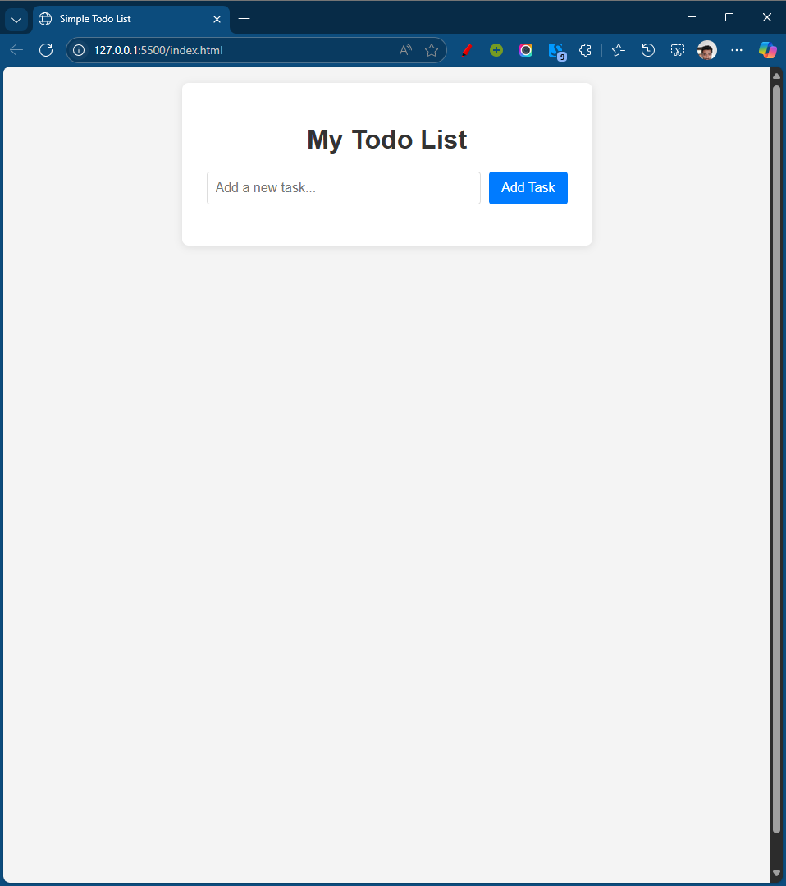
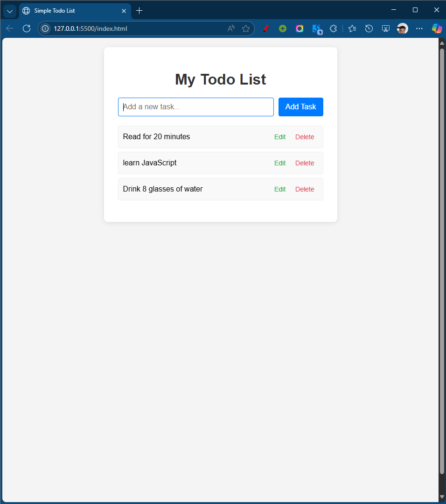
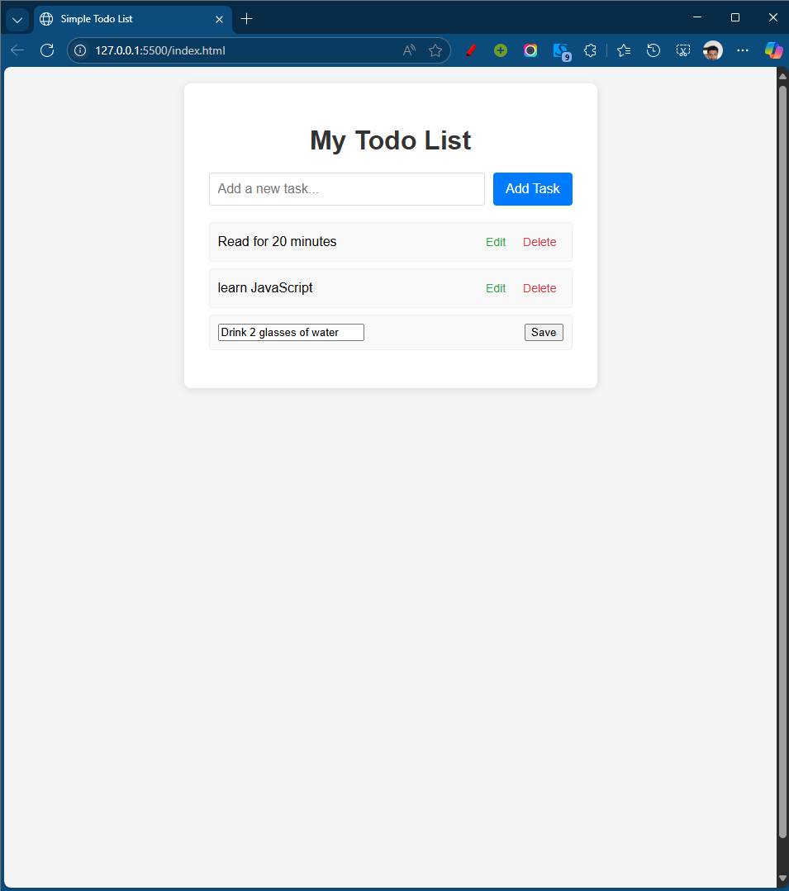

# Simple Todo List Application

This is a simple web-based Todo List application built using HTML, CSS, and JavaScript. It allows users to add, edit, and delete tasks, and persists the tasks in the browser's local storage.

## Features

- **Add Task**: Quickly add new tasks to your list.
- **Edit Task**: Modify existing tasks.
- **Delete Task**: Remove tasks that are no longer needed.
- **Persistence**: Your tasks are saved in your browser's local storage, so they remain even if you close and reopen the browser.

## Screenshots

To be added after you run the application and take screenshots. You should replace these placeholders with actual image links.

### Initial State


_Description: This screenshot shows the Todo List application immediately after opening, with the "Add a new task..." input field and the "Add Task" button._

### Task Added


_Description: This screenshot demonstrates a task ("Buy groceries") successfully added to the list, showing the task text, an "Edit" button, and a "Delete" button._

### Editing a Task


_Description: This screenshot displays the application while a task is being edited. The task text is replaced by an input field, and the "Edit" button is replaced by a "Save" button._

## How to Run

To run this application locally, follow these simple steps:

1.  **Clone the repository** (or download the files directly):

    ```bash
    git clone https://github.com/yonas-baysasaw/Todo-List.git
    ```

    If you downloaded the files, just extract the zip archive.

2.  **Navigate to the project directory**:

    ```bash
    cd Todo-List
    ```

3.  **Open `index.html`**:
    Simply open the `index.html` file in your preferred web browser (e.g., Chrome, Firefox, Edge). You can do this by double-clicking the file in your file explorer.

The application will load in your browser, and you can start adding, editing, and deleting tasks.

## Technologies Used

- **HTML5**: For the structure of the web page.
- **CSS3**: For styling and layout.
- **JavaScript (ES6+)**: For interactive functionality.
- **Local Storage**: To persist tasks in the browser.

## Author

Yonas Baysasaw
